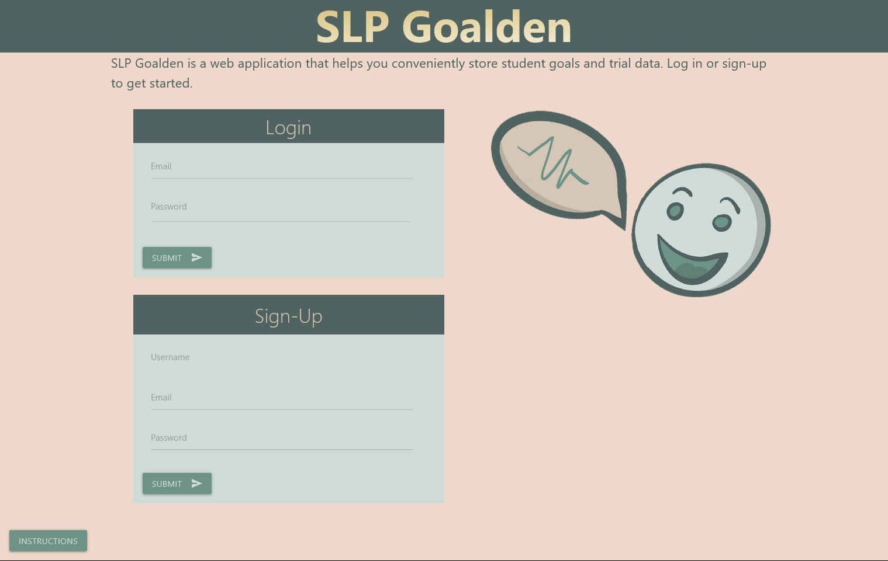
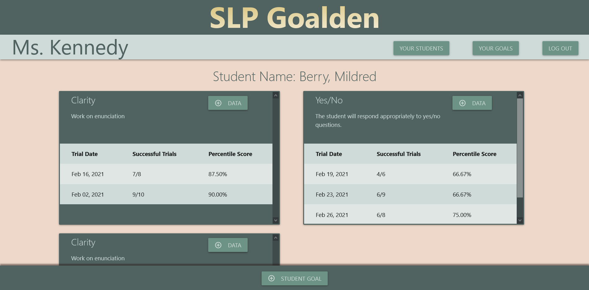

# SLP Goalden

## Description 

SLP Goalden is a simple application designed to help speech language pathologists keep track of student goals and goal progress.

---

## Table of Contents 

- [Website](#website)
- [Built With](#built-with)
- [Usage](#usage)
- [License](#license)
- [Contributors](#contributors)
- [Acknowledgements](#acknowledgements)

---

## Website

https://mighty-falls-97052.herokuapp.com/

---

## Built With

[Back to Contents](#table-of-contents)

---

## Usage

To use SLP Goalden, simply follow the link to the deployed application and sign up by providing a username, unique email, and a password.

[Back to Contents](#table-of-contents)

---

## License

This project is covered under the MIT License.

[Back to Contents](#table-of-contents)
  
---

## Contributors

---
---
    
Craig Bennett
    
[Craig5117](https://github.com/Craig5117)

- JS
- Sequelize
- HTML and CSS
- Project design
- Front-End Routes
- Add student goal page
- Mobile Responsiveness

---
---
    
Adam Crandall
    
[fancibleunicorn](https://github.com/fancibleunicorn)

- JS
- Sequelize
- Database Models
- Password Encryption
- Logo Image

---
---
    
Ethan Dodgen
    
[EthanDodgen](https://github.com/EthanDodgen)

- HTML and CSS
- Goal Submission page
- Login Page
- Student Submission page

---
---
    
Jessica Jensen
    
[jrjensen14](https://github.com/jrjensen14)

- HTML and CSS
- Single Student Page
- All Goals Page
- Trial Submission Page
- Mobile Responsiveness

---
---

Lydia Kennedy

[Lydia-tech](https://github.com/Lydia-tech)

- HTML and CSS
- Main layout
- Dashboard
- All Students page
- Mobile Responsiveness

---
---
    
Sylvester Nwizu
    
[toksly](https://github.com/toksly)

- JS
- Sequelize
- Api routes

---
---

[Back to Contents](#table-of-contents)

---

## Acknowledgements

- [Tech badges by Ileriayo](https://github.com/Ileriayo/markdown-badges)
- [Express.js](https://www.npmjs.com/package/express)
- [dotenv](https://www.npmjs.com/package/dotenv)
- [Handlebars](https://handlebarsjs.com/)
- [express-session](https://www.npmjs.com/package/express-session)
- [mysql2](https://www.npmjs.com/package/mysql2)
- [sequelize](https://sequelize.org/)
- [cookie-parser](https://www.npmjs.com/package/cookie-parser)
- [Materialize](https://materializecss.com/)

[Back to Contents](#table-of-contents)